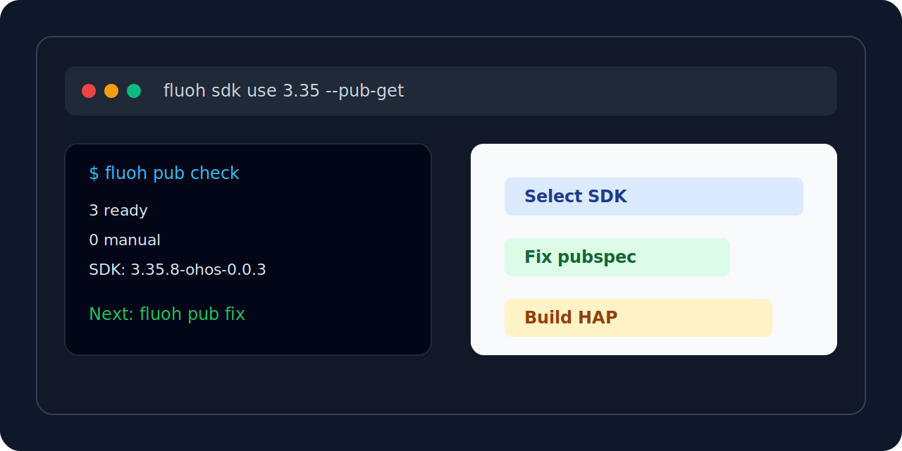
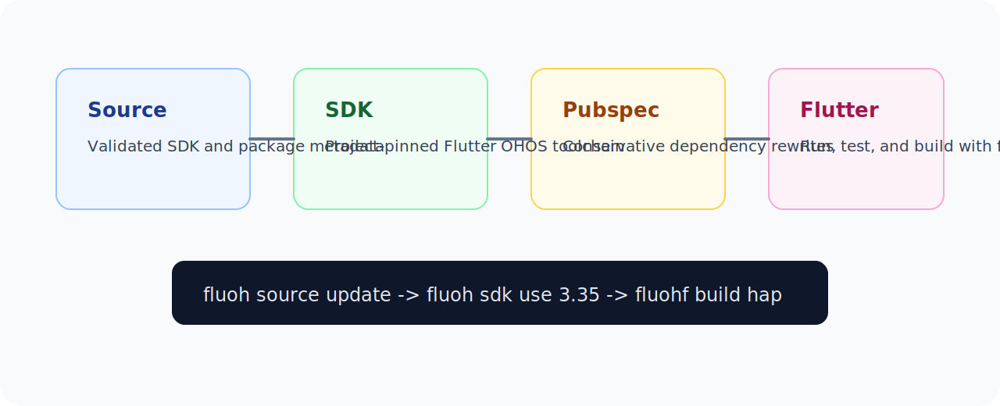

# fluoh

<p align="center">
  <strong>A command-line toolkit for FlutterOH projects.</strong>
</p>

<p align="center">
  Select the Flutter OHOS SDK, keep dependency replacements up to date, and run Flutter through the selected toolchain.
</p>

<p align="center">
  <a href="https://pub.dev/packages/fluoh"></a>
  <a href="https://github.com/FlutterOH/fluoh/actions/workflows/ci.yml"></a>
  <a href="LICENSE"></a>
</p>

<p align="center">
  <a href="#quick-start">Quick start</a> ·
  <a href="docs/commands.md">Commands</a> ·
  <a href="docs/schema.md">Schema</a> ·
  <a href="CONTRIBUTING.md">Contributing</a> ·
  <a href="README.zh-CN.md">简体中文</a>
</p>

<p align="center">
  
</p>

`fluoh` helps FlutterOH projects keep SDK selection, IDE configuration,
dependency replacements, and Flutter command execution in sync. It records the
selected SDK in the project, exposes a stable IDE SDK link, and runs Flutter
through the same toolchain from the terminal.

## Quick Start

```sh
dart pub global activate fluoh

cd your_flutter_project
fluoh source update
fluoh sdk use 3.35 --pub-get
fluoh pub check
fluoh pub fix
fluohf build hap
```

After setup, the project has an exact SDK version in `fluoh.yaml`, a stable IDE
SDK link at `.fluoh/flutter_sdk`, and FlutterOH dependency replacements from
the latest validated snapshot.

## Install

```sh
dart pub global activate fluoh
fluoh --version
```

Make sure Dart's global pub bin directory is on `PATH`:

```sh
export PATH="$HOME/.pub-cache/bin:$PATH"
```

macOS users can also install with Homebrew:

```sh
brew tap FlutterOH/tap
brew install fluoh
```

## Common Workflows

| Workflow | Command |
| --- | --- |
| Pick and pin a Flutter OHOS SDK | `fluoh sdk use 3.35 --pub-get` |
| Run Flutter from the selected SDK | `fluohf pub get`, `fluohf run`, `fluohf build hap` |
| Check FlutterOH dependency support | `fluoh pub check` |
| Rewrite dependencies safely | `fluoh pub fix --dry-run`, `fluoh pub fix` |
| Update existing FlutterOH dependency replacements | `fluoh pub upgrade` |
| Clean generated project output | `fluoh clean` |
| Diagnose project setup | `fluoh doctor` |
| Upgrade the CLI | `fluoh upgrade` |

<p align="center">
  
</p>

## Daily Loop

```sh
fluoh sdk list
fluoh sdk use 3.35 --pub-get

fluoh pub check
fluoh pub fix --dry-run
fluoh pub fix
fluoh pub get

fluohf pub get
fluohf run
fluohf build hap
```

## Maintainer Workflows

Most app projects only need the commands above. FlutterOH package maintainers
can also create, sync, test, and release third-party FlutterOH pub repositories:

```sh
fluoh pub create
fluoh pub sync
fluoh test init
fluoh test run
fluoh pub release
fluoh source sync
```

See [docs/commands.md](docs/commands.md) for the full command surface and
[CONTRIBUTING.md](CONTRIBUTING.md) for repository, release, and publishing
workflows.

## Source Data

`fluoh` uses the official FlutterOH source by default:

```text
https://github.com/FlutterOH/pub.git
```

Source metadata and compatibility schema details are documented in
[docs/schema.md](docs/schema.md).

## License

MIT
