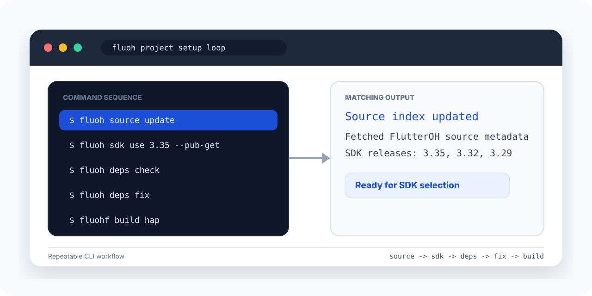

<h1 align="center">
  
  fluoh
</h1>

<p align="center">
  Bring Flutter apps to OpenHarmony faster.
</p>

<p align="center">
  <a href="https://pub.dev/packages/fluoh"></a>
  <a href="https://github.com/FlutterOH/fluoh/actions/workflows/ci.yml"></a>
  <a href="LICENSE"></a>
</p>

<p align="center">
  <a href="#quick-start">Quick start</a> ·
  <a href="#maintenance-workflows">Maintenance</a> ·
  <a href="docs/commands.md">Commands</a> ·
  <a href="docs/schema.md">Schema</a> ·
  <a href="CONTRIBUTING.md">Contributing</a> ·
  <a href="README.zh-CN.md">简体中文</a>
</p>

<p align="center">
  
</p>

`fluoh` helps FlutterOH projects keep SDK selection, IDE configuration,
dependency replacements, and Flutter command execution in sync. It records the
selected SDK in the project, exposes a stable IDE SDK link, and runs Flutter
through the same toolchain from the terminal.

## Quick Start

```sh
dart pub global activate fluoh

cd your_flutter_project
fluoh source update
fluoh sdk use 3.35 --pub-get
fluoh deps check
fluoh deps fix
fluoh deps get
fluohf build hap
```

After setup, the project has an exact SDK version in `fluoh.yaml`, a stable IDE
SDK link at `.fluoh/flutter_sdk`, an `ohos/` platform directory, and FlutterOH
dependency replacements from the latest validated snapshot.
Use `--no-init-ohos` when platform creation is handled by another workflow.

## Install

```sh
dart pub global activate fluoh
fluoh --version
```

Make sure Dart's global pub bin directory is on `PATH`:

```sh
export PATH="$HOME/.pub-cache/bin:$PATH"
```

macOS users can also install with Homebrew:

```sh
brew tap FlutterOH/tap
brew install fluoh
```

## Common Workflows

| Workflow | Command |
| --- | --- |
| Pick and pin a Flutter OHOS SDK | `fluoh sdk use 3.35 --pub-get` |
| Run Flutter from the selected SDK | `fluohf pub get`, `fluohf run`, `fluohf build hap` |
| Check FlutterOH dependency support | `fluoh deps check` |
| Rewrite dependencies safely | `fluoh deps fix --dry-run`, `fluoh deps fix` |
| Update existing FlutterOH dependency replacements | `fluoh deps upgrade` |
| Diagnose project and native platform setup | `fluoh doctor project`, `fluoh doctor env --platform all` |
| Upgrade the CLI | `fluoh upgrade` |

### Daily Loop

```sh
fluoh sdk list
fluoh sdk use 3.35 --pub-get

fluoh deps check
fluoh deps fix --dry-run
fluoh deps fix
fluoh deps get

fluohf run
fluohf build hap
```

## Maintenance Workflows

Most app projects only need the commands above. FlutterOH package maintainers
can also create, sync, check, and release third-party FlutterOH package repositories:

```sh
fluoh package create <upstream-git-url>
fluoh package sync
fluoh package status
fluoh package check
fluoh package release
fluoh source sync
```

### AI Assistance

For maintainers adapting a third-party Flutter package, let `fluoh` create the
repository contract first:

```sh
fluoh package create <upstream-git-url> --repository <flutteroh-repo-url> --git-author-name "<author-name>" --git-author-email "<author-email>"
```

Then open the generated repository in an AI coding agent and ask it to read
`AGENTS.md` and complete the adaptation. The generated `AGENTS.md` and
`FLUOH.md` give the agent a staged command flow: `fluoh doctor project` for
repository state, `fluoh doctor env --platform all` for local toolchains,
`fluoh package check --preset ohos-run|android-run|ios-run --json` for
diagnostics-driven implementation loops, JSON `nextCommand` for the next
action, and `.fluoh/ai-report-...md` for the final release recommendation.
Review the final diff and device-only behavior before release.

See [docs/commands.md](docs/commands.md) for the full command surface and
[CONTRIBUTING.md](CONTRIBUTING.md) for repository, release, and publishing
workflows.

## Source Data

`fluoh` uses the official FlutterOH source by default:

```text
https://github.com/FlutterOH/source.git
```

A Source is fluoh's metadata feed for Flutter OHOS SDK releases and package
compatibility records. Most app projects only need `fluoh source update`.

Source metadata and compatibility schema details are documented in
[docs/schema.md](docs/schema.md).

## License

MIT
