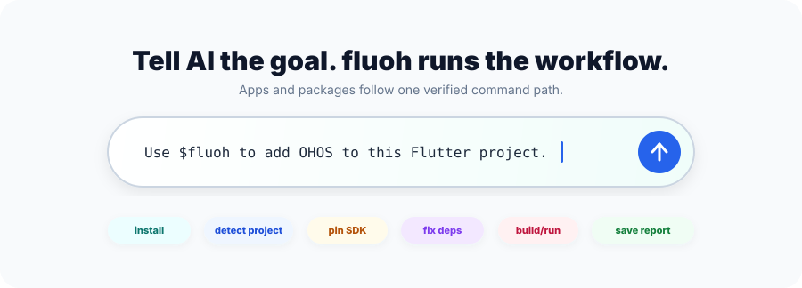

<h1 align="center">
  
  fluoh
</h1>

<p align="center">
  Adapt Flutter apps and packages to OHOS with AI.
</p>

<p align="center">
  <a href="https://pub.dev/packages/fluoh"></a>
  <a href="https://github.com/FlutterOH/fluoh/actions/workflows/ci.yml"></a>
  <a href="skills/fluoh/SKILL.md"></a>
  
  <a href="LICENSE"></a>
</p>

<p align="center">
  <a href="#quick-start">Quick start</a> ·
  <a href="skills/fluoh/SKILL.md">Skill</a> ·
  <a href="doc/commands.md">Commands</a> ·
  <a href="doc/schema.md">Schema</a> ·
  <a href="CONTRIBUTING.md">Contributing</a> ·
  <a href="README.zh-CN.md">简体中文</a>
</p>

<p align="center">
  
</p>

## Quick Start

Ask your AI agent to install the skill first:

```text
Install the fluoh skill from https://github.com/FlutterOH/fluoh/tree/main/skills.
```

Then type one request for an app or a package:

```text
Use $fluoh to install fluoh if needed and adapt this Flutter project for OHOS.
Use $fluoh to adapt <upstream-git-url> for FlutterOH.
Use $fluoh to continue adapting <package-name> for OHOS.
```

The skill checks `fluoh --version`, runs read-only setup checks, asks for final
setup confirmation before project or package changes, follows JSON diagnostics,
edits and verifies the target, then writes
`.fluoh/reports/<scope>/ai-report-...md`. It prefers
`dart pub global activate fluoh`, with Homebrew as the macOS fallback. Trace
capture, report layout, and package repository details live in the command and
skill docs.

If the CLI is already installed:

```text
Run `fluoh skill --json`, install the returned localPath as a skill, then reload skills if needed.
```

The skill version follows the `fluoh` CLI version. After `fluoh upgrade`, run
`fluoh skill --json` again and reload the returned path.

## Manual Fallback

When you need to install or drive the CLI yourself:

```sh
dart pub global activate fluoh
fluoh sdk use 3.35 --pub-get
fluoh deps check
fluoh deps fix
fluoh doctor -p --platform ohos
fluoh build --platform ohos --auto-sign
```

macOS alternative:

```sh
brew tap FlutterOH/tap
brew install fluoh
```

Homebrew installs native executables, which are better for strict `--json`
automation.

For package maintainers:

```sh
fluoh package create <upstream-git-url> --repository-name <flutteroh-repo-name>
fluoh verify
fluoh package status
```

For monorepos, keep one FlutterOH adaptation repository per upstream repository
and create one `ohos/<sdkLine>/<package>` branch per package. Start with
`--package-path`, then use `fluoh package queue` and `fluoh package add` for
additional packages. See [Command reference](doc/commands.md) for version,
report, and `--org` details.

Use `fluohf` to run Flutter through the selected FlutterOH SDK:

```sh
fluohf pub get
fluohf run
fluohf build hap
```

## Links

- [Command reference](doc/commands.md)
- [Source schema](doc/schema.md)
- [Contributing and release workflow](CONTRIBUTING.md)
- [Official source data](https://github.com/FlutterOH/source.git)

## License

MIT
