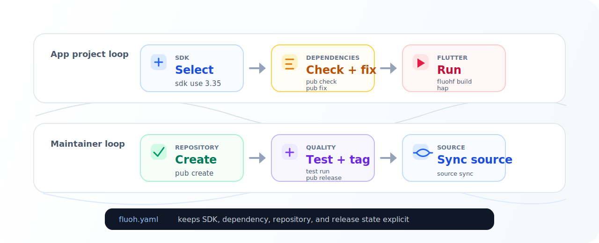

<h1 align="center">
  
  fluoh
</h1>

<p align="center">
  <strong>FlutterOH 项目的命令行工具包。</strong>
</p>

<p align="center">
  选择 Flutter OHOS SDK，保持依赖替换更新，并始终通过同一套工具链运行 Flutter。
</p>

<p align="center">
  <a href="https://pub.dev/packages/fluoh"></a>
  <a href="https://github.com/FlutterOH/fluoh/actions/workflows/ci.yml"></a>
  <a href="LICENSE"></a>
</p>

<p align="center">
  <a href="#快速开始">快速开始</a> ·
  <a href="docs/commands.zh-CN.md">命令</a> ·
  <a href="docs/schema.zh-CN.md">Schema</a> ·
  <a href="CONTRIBUTING.zh-CN.md">贡献指南</a> ·
  <a href="README.md">English</a>
</p>

<p align="center">
  
</p>

`fluoh` 用来统一 FlutterOH 项目的 SDK 选择、IDE 配置、依赖替换和 Flutter 命令执行。
它会把选中的 SDK 记录到项目中，提供稳定的 IDE SDK 链接，并让终端命令始终使用同一套工具链。

## 快速开始

```sh
dart pub global activate fluoh

cd your_flutter_project
fluoh source update
fluoh sdk use 3.35 --pub-get
fluoh pub check
fluoh pub fix
fluohf build hap
```

配置完成后，项目会在 `fluoh.yaml` 中记录精确的 SDK 版本，`.fluoh/flutter_sdk`
会作为稳定的 IDE SDK 链接，FlutterOH 依赖替换来自最新校验通过的快照。

## 安装

```sh
dart pub global activate fluoh
fluoh --version
```

确保 Dart pub 的全局可执行目录在 `PATH` 中：

```sh
export PATH="$HOME/.pub-cache/bin:$PATH"
```

macOS 用户也可以通过 Homebrew 安装：

```sh
brew tap FlutterOH/tap
brew install fluoh
```

## 常见工作流

| 场景 | 命令 |
| --- | --- |
| 选择并固定 Flutter OHOS SDK | `fluoh sdk use 3.35 --pub-get` |
| 通过已选择的 SDK 运行 Flutter | `fluohf pub get`, `fluohf run`, `fluohf build hap` |
| 检查 FlutterOH 依赖支持 | `fluoh pub check` |
| 安全改写依赖 | `fluoh pub fix --dry-run`, `fluoh pub fix` |
| 更新已有的 FlutterOH 依赖替换 | `fluoh pub upgrade` |
| 清理生成的项目输出 | `fluoh clean` |
| 诊断项目配置 | `fluoh doctor` |
| 升级 CLI | `fluoh upgrade` |

<p align="center">
  
</p>

## 日常循环

```sh
fluoh sdk list
fluoh sdk use 3.35 --pub-get

fluoh pub check
fluoh pub fix --dry-run
fluoh pub fix
fluoh pub get

fluohf pub get
fluohf run
fluohf build hap
```

## 维护者工作流

大多数应用项目只需要上面的命令。FlutterOH package 的维护者还可以使用下面的命令创建、
同步、测试和发布第三方库 FlutterOH pub 仓库：

```sh
fluoh pub create <upstream-git-url>
fluoh pub sync
fluoh test init
fluoh test run
fluoh pub release
fluoh source sync
```

完整命令见 [docs/commands.zh-CN.md](docs/commands.zh-CN.md)，仓库维护、发布和打包流程见
[CONTRIBUTING.zh-CN.md](CONTRIBUTING.zh-CN.md)。

## Source 数据

`fluoh` 默认使用 FlutterOH 官方 source：

```text
https://github.com/FlutterOH/pub.git
```

Source 元数据和兼容性 schema 的细节见
[docs/schema.zh-CN.md](docs/schema.zh-CN.md)。

## 许可证

MIT
